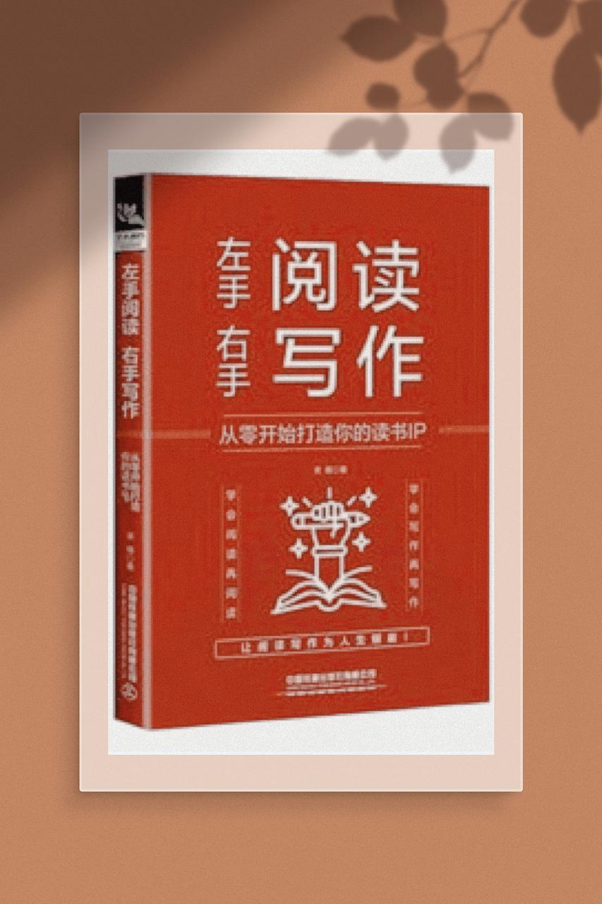

# 「拆书 2」《简单法则》(简单让时间价值最大化)

<!--  -->

你好，我是六检一，「微信读书 App」重度使用者。

今天我们来拆“学术界乔布斯”前田约翰的《简单法则》一书。

没有人喜欢复杂，复杂意味着你需要花费更多的时间，然而我们这一生，最应该慎重消费的就是时间。

首先是化简。它是实现简单最简单的途径，移除尽可能无用的设计，进行压缩和隐藏，如果这些设计被人惊喜的发现，产生一种“哇塞”的反应，那便是成功了。

整理。通过分类（sort），标注（label），整合（integrate）和排序（prioritize），可以帮你将系统化繁为简，整理锻炼的是抽象的能力，抽象能力越强，可以让你越高屋建瓴的看很多事情。

省时。节省时间可以使生活变得简单。出门旅行的你，可能会选火车、高铁、飞机，抛开价格，飞机是最优的选择，它最省事，而节省下来的时间你又可以去做很多其他的事情。当然还是价格因素，这就需要我们权衡在经济满足的情况下，去选择尽可能节省时间的交通工具，从而尽自己最大的可能去省时。让生活变得充实而有效的关键，是要知道什么多用心，什么时候少分心。

学习。知识让一切变简单，这句话在任何情况下都适用。知识可以变现，钱可以解决太多的问题了，会让很多事情简单很多。书中在这里对学习给了一个非常好的建议，那就是重复，要再三重复，这和温故而知新并无二异。

差异。简单和复杂相辅相成，因为复杂，我们才知道什么是简单。这里想表达的是你我都是普通人，能体现出差异，你才会比别人更好。

环境。简单的周边环境看似无关，实则非常重要。张小龙曾说，人是环境的反应器。空白越多，展示的信息就越少，关注度就越高，稀缺会让我们更加珍视所拥有的一切。

情感。在设计中注入情感总是好的。除了物质本身带来的功能属性外，它在情感上的价值也很重要，在已经很简单的物质上，再赋予一些情感，会让它更加出色。

信任。如果信任，所以简单。拿装修举例，如果你足够信任一家装修公司，那么完全可以全包给他，你自己也会因此简单。当然，生活中还有其他的，只要你可以信任，那就可以让很多事情变得简单。

失败。也有很多事情是无论如何都简单不了的。在实现简单的道路上遭遇失败，对我们也是有益和弥足珍贵的。

合一。本书最后一个法则，究其核心，简单就是去“明显”而添“意义”。

简单是明智之举，最终的目的，就是给创造简单的人或因简单而受益的人带去价值。

这十个主题，起指导意义的应该是前九个，无论是哪个，只要知道并实践到其中一个，都可以让你逐渐简单起来。
