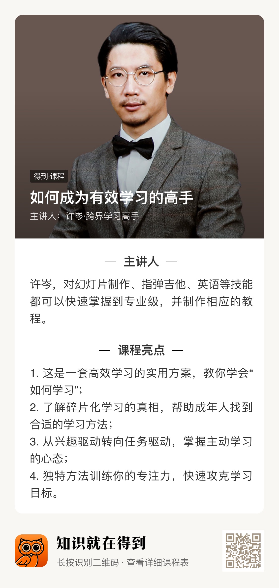

# 【学点啥-1】许岑《如何成为有效的学习高手》

上周读到池老师《卖桃者说》第 100 篇“高效学习的样本”，也思考了以前学过的东西，学了很多但是掌握的很少，问题可能就是学习不够有效和高效。池老师在文中提到了许岑老师在得到的《如何成为有效的学习高手》课程，花了一周的时间深入地学习了下，写下这篇算是给自己一个学后的文字反馈。

对于高效学习的定义，许岑老师给出：**找到适合自己的学习手法，在相对短的时间内集中注意力，以解决一个工作和生活中的难题为目的着手学习，你需要勤加练习，有时候还需要向名师求助。**

将上面这句话一一拆解。

### 适合自己的学习方法

首先要分辨学习对象的种类。学习对象分两种，一种是自然主义，一种是结构主义。自然主义说的是模仿，不断模仿要学习的东西，积少成多，以量取胜，比如：写字帖。结构主义说的是创造，对学习的内容要按部就班，从基础开始，学完之后为了创造出新的东西。比如：学习 App 开发的编程语言，是为了创造 App，以解决一些需求。

分清了学习对象，学习就变得有效了，那接下来的问题就是如何高效起来。通过把目标拆碎，反复练习小细节。

这里要着重说一下**碎片化学习**。

**有一种假的碎片化学习叫收藏**。你应该和我一样都有收藏的习惯，但是收藏之后就搁置了，基本没看过。所以许岑老师从来不收藏任何东西。碎片化学习一定是为了辅助你近期的学习目标。把学习目标拆碎，就好比把瓷器摔碎，然后花时间带着问题和困惑去执行碎片化学习，最后的效果就是把这些碎片全都捡起来，连接起来。

有了小目标之后，可能还是学不好。那你可能跟我一样觉得学不好就是兴趣不够，当然兴趣够强的话大概率是能学好的，但对大多数人来说兴趣是很难培养的，但是如果把兴趣换成必须完成的任务，**用任务驱动学习**，那就适合我们了。生活中可以带着任务驱动，工作中以职业的强迫来驱动，也可以以教为学（每个人都可以当老师）。

**在相对短的时间内集中注意力（以周为维度）**

这里要说的是拖延症，学名”注意力缺陷多动障碍“。科学上这种人，完成中学学业的人很少，完成大学学业的更是寥寥无几。所以大部分人都没有拖延症。日常生活和工作中，谁多多少少都有拖延的表现，谁都想做自己喜欢的事情，但把不喜欢的事情做了，才是需要解决的难题。**将任务严峻化**，不断做成一件事，然后形成惯性。举个例子，假如一项任务完不成，就失业了，或者会损失几十万，那是不是就不敢拖延了。

任务严峻化后，也可能还不够专注，毕竟不会真的失业或者损失几十万。因为专注力决定了做事和学习的效率，所以专注力要提升上来。

在衣食住行上不断训练专注力。

买贵的学习工具，并不是说奢侈品，是那种能让自己稍微心疼一点的。许岑老师学吉他，买了一把好几万的吉他，天天练天天学，不学都觉得浪费了。如果换成几百块的吉他，那估计就变成偶尔拿出来弹弹了。

认认真真给自己做饭吃，要吃的有仪式感。

使用射灯，让光束聚在一个小的范围内，就像自己在舞台中央一样。

困了就睡，睡眠充足了之后，才能更专注。

**以解决一个工作和生活中的难题为目的着手学习**

设定有效目标，也就是这个目标或者说难题要是有效的。假如要学英语，但是目标却是为了未来可能会用到，那就不是有效的，也不是高效的，因为学了并没有马上应用的场景。如果说学英语，为了考学，外企工作，有了应用的场景，这个思路就对了。

直奔大师，不必从基础开始。还是英语学习，如果为了看懂英语文章，从新概念学起，那肯定是不现实的，直接学就可以了，不懂了直接查词典。这个是许岑老师想表达的：要去到哪里就从哪里开始。假如说你为了学英语教别人，那就应该按部就班的一步一步学。所以要根据目标决定从哪里找学习的切入点。

**你需要勤加练习**

对学习内容需要勤加练习，但这还不够。真正有效的学习，需要制造反馈。

可以制造文字反馈。像我这篇对课程做个文字总结。并不是原文摘抄，也不是默写，就是大致把内容总结翻译一下。

也可以制造音频反馈。把自己读的英语录下来，反复听，然后纠正读音。

还可以制造视频类反馈。把自己的投篮姿势录下来，反复看，反复调整。

许岑老师举了他父亲教他物理题的例子，让他对刚讲过的物理题再讲一遍，这时候他发现自己讲不出来。这就是反馈的意义。不反馈你都不知道自己会不会。

**向名师求助**

我们都会遇到瓶颈，有的可以通过调整心态解决，有的可能是自己涉猎的范围不够广，需要扩大涉猎范围，要不断增加积累，功夫在诗外。

还可以找名师求助。许岑老师高考前就找了数学名师，教了他把注意力集中在一个更狭窄的范围内，以做到不分心，从而让自己只专注于把选择题做好，高考数学成绩比平时提高了 20 多分。当然，很多人可能都没有向名师求助的机会，但请相信总会有机会的。

比如我，我身边就有一个名师，池建强老师。去年从公众号有了可以加池老师微信的途径，我就毫不犹豫抓住了这个机会。

**学点什么都会有用的**

学点什么，以周为单位，并制造反馈，分享给你~

